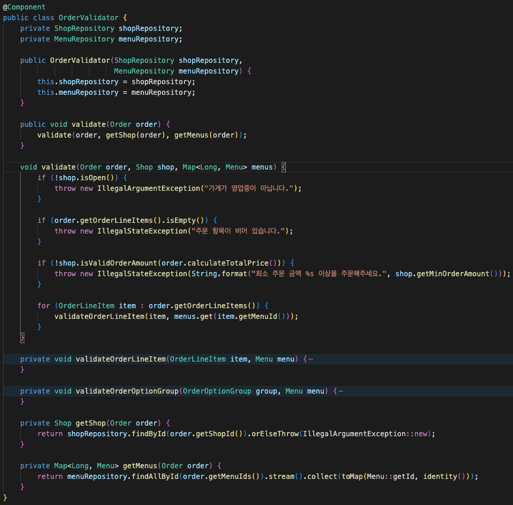
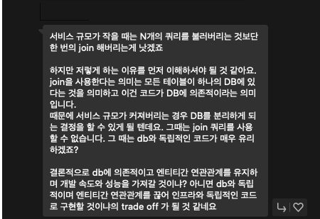

# 개요
안녕하세요 저는 요즘 조영호님의 객체지향 설계에 대한 세미나 영상들을 보고 있는데요.  
세미나 영상 중 궁금한 점들이 생겼으나 해결이 안돼서 ㅠㅠ 도움을 받고자 질문드립니다!

자바/스프링과 관련된 코드이지만, 백엔드 지식과도 연관이 있다고 생각해서 NestJS 방에 질문드리는 점 이해해주시면 감사하겠습니다! :)

## 질문사항
1. JPA / TypeORM 등을 사용할 때 양방향 연관관계를 끊어내려고 연관관계 대신 조회쿼리를 사용하는 것 같은데, 이렇게 개발하는 게 성능이나 클린코드 등에 문제가 없을까요?
      - A : 연관관계로 다른 Entity를 가져오기 (join 된 상태에서)
      - B : 조회쿼리(findOne)으로 다른 Entity 가져오기
     
2. 하나의 API 요청을 처리하기 위해 5개 이상의 조회 쿼리 등을 사용해도 괜찮은걸까요?
      - `초보이다보니 성능을 위해선 무조건 DB에 요청(조회, 수정)하는 횟수를 줄여야돼!`라는 생각을 가지는 것 같습니다.
      - 혹시 하나의 API 요청을 처리할 때에 이정도는 넘으면 안돼! 라는 기준이 있을까요?
        - 물론 항상 trade-off 하시고 계시겠지만, 현업에서 일하고 계신 개발자분들께서 생각하시는 기준이 궁금합니닷..

## 질문이유
- 조영호님께서 예제로 공개하신 코드를 보면 주문이라는 행위를 처리하기 위해 여러 도메인으로 쪼개고 각자의 도메인과 관련된 행위의 처리를 분리(격리?)해두셨는데요.
- 그러다보니 아래의 사진과 같이 Entity 객체를 전달하고, 그 객체와 관련된 Entity 객체를 가져오기 위해 조회쿼리를 날리는 걸 볼 수 있습니다.
- 아래의 경우는 상점에 주문이 가능한지 검증을 하는 로직뿐이지만, 
- 도메인 요구사항이 더 복잡해주실수록 `findById`와 같이 단순 조회성 쿼리들이 8개가 넘어가는 상황이 일어날 것 같은데, 성능상 괜찮은 것인지를 모르겠어서 

## 출처
예제 : https://github.com/eternity-oop/Woowahan-OO-03-domain-event  
관련영상 : https://www.youtube.com/watch?v=dJ5C4qRqAgA&ab_channel=%EC%9A%B0%EC%95%84%ED%95%9CTech
## 답변
