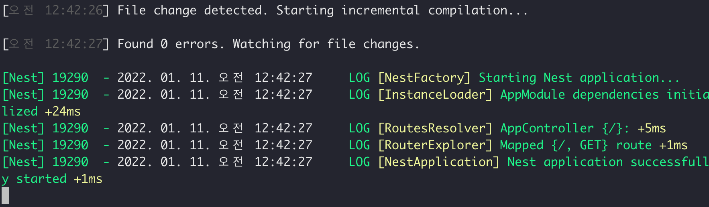
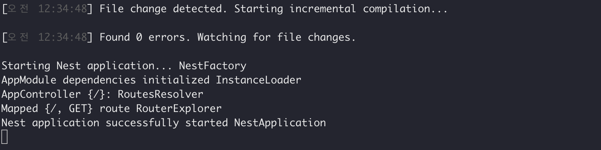

# NestJS Techniques Logging 
#### (참고사항 - 개인적으로 궁금해서 공식문서 내용 확인해봄)

```js
// main.ts
import { NestFactory } from '@nestjs/core';
import { AppModule } from './app.module';

async function bootstrap() {
  const app = await NestFactory.create(AppModule, {
    logger: console,
  });
  await app.listen(3000);
}
bootstrap();
```

  



참고자료 :  
*-* [NestJS Logger Document](https://docs.nestjs.com/techniques/logger)