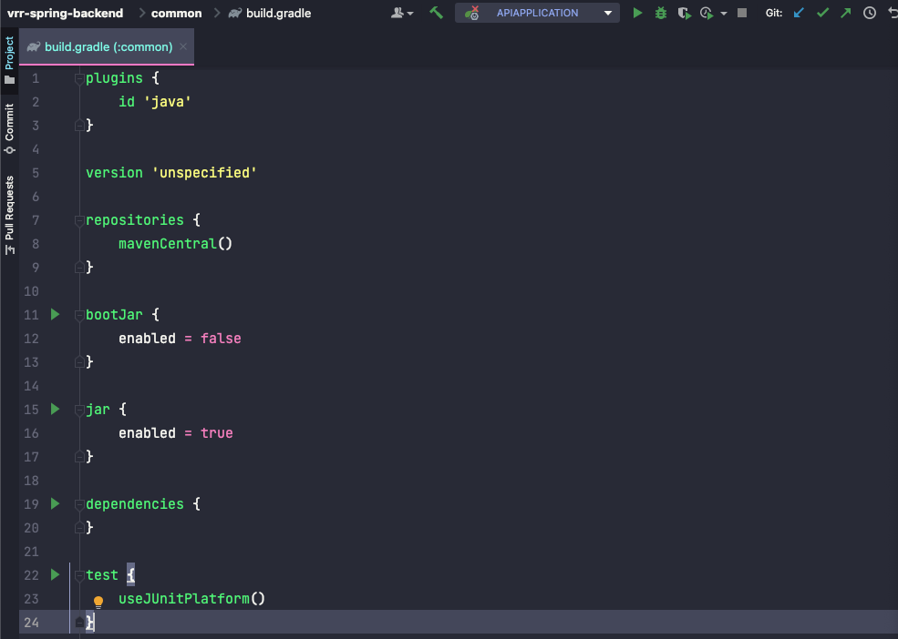

## 개요
요즘 토이프로젝트를 진행하면서 Gradle7, Spring 환경에서 멀티모듈을 활용해 프로젝트를 구성하고 있습니다. 이 과정에서 의존성을 관리하는 것에 궁금함이 있었습니다.  
본 포스팅은 관련된 궁금점에 대해 해결이 된 부분을 정리합니다.  

## 시작하면서
처음 프로젝트 구성할 때는 단순히 어플리케이션 모듈과 공통 모듈로 분리하여 각각의 모듈로 구성하면 되겠다! 정도로 생각했습니다. 그러나 현실은 언제나처럼 제 이론과는 반대로 동작했습니다.  
멀티모듈로 프로젝트를 구성하는 것의 최고 장점이라면 기능별로 모듈을 분리하면서 각각의 모듈을 독립적으로 구성할 수 있다는 것입니다. 이로 인해 각 모듈의 의존성을 최소로 관리하여 재사용에 사용할 수 있게 됩니다.  
그러나 저는 공통 모듈에 공통으로 쓰일 것 같은 모든 로직을 집어 넣게 되었고 결과적으로 공통모듈은 프로젝트 전반에 필요한 의존성을 모두 가진 뚱뚱한 모듈이 되어버렸습니다.  
따라서 공통모듈을 의존하는 어플리케이션은 필요없는 의존성 또한 어쩔 수 없이 의존하게 되었습니다.  
이를 해결하기 위해 여러 자료들을 찾아보며 해결 전략을 세웠습니다.

### 해결전략
모든 공통 로직을 공통 모듈에서 관리하지 말고, 각각의 기능에 집중해 모듈을 구성하자!  
참고한 [포스팅](https://techblog.woowahan.com/2637/)에서는 크게 5개 레이어를 구성해 모듈을 관리했습니다만 저는 그 중 4개의 방식만을 채택하여 구성하였습니다.

이 해결전략에 대한 PR은 아래에서 확인이 가능합니다.  
- https://github.com/VRR-TEAM/vrr-spring-backend/pull/8  

#### VRR 전체 프로젝트
- 어플리케이션 : application module
- 도메인 : domain module
- 외부 서비스 : client module
- 공통모듈 : common module

#### 모듈간 의존관계도 

#### 공통 모듈
공통모듈은 모든 모듈에서 참조하여 사용할 수 있도록 별도의 의존성을 가지지 않는 순수 JAVA 코드로만 구성하여 `dependencies`가 항상 비어있도록 개발하였습니다. 프로젝트에서 공통으로 사용하는 공통코드(ENUM), 유틸 클래스, 어노테이션들을 관리하는 모듈로 관리하였습니다.

#### 도메인 모듈
도메인 모듈은 프로젝트 내의 핵심 도메인 로직들을 나타내는 `Entity`, `EntityRepository`, `DomainService`들로 구성하였습니다.

## 문제 #1
Gradle 7 이전에는 compile 명령을 활용해 의존성을 불러왔음.
그러나 이제는 `api`, `implementation` 명령을 통해 의존성을 관리함.  
- api : 불러오는 라이브러리가 의존하고 있는 관련된 다른 라이브러리들까지 같이 불러옴
- implementation : 불러오는 라이브러리만 불러옴

멀티모듈 프로젝트 구성시 공통모듈(common), 도메인 모듈(domain) 등의 모듈을 구축하게 된다.  
이러한 모듈들은 api 명령을 활용해 어플리케이션 모듈에서 해당 모듈들을 불러올 시 관련된 의존성을 한꺼번에 불러올 수 있도록 하는 것이 좋다.
반면에 어플리케이션 모듈에서 의존성을 불러올 경우에는 implementation을 활용해 별도의 하위 의존성을 노출하지 않도록 합니다.  

## 관련 포스팅
[우아한 형제들 기술블로그 - 멀티모듈 설계 이야기](https://techblog.woowahan.com/2637/)