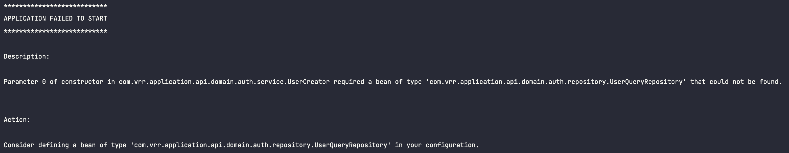
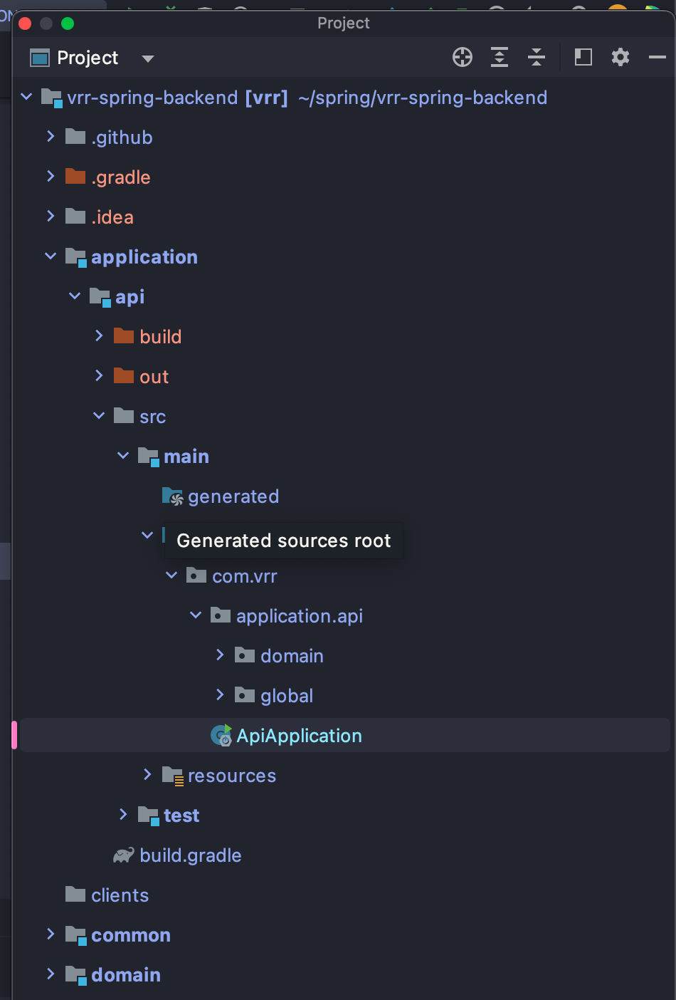

## 개요
앞서서 멀티 모듈을 구성하는 과정에 대해 설명한 [포스팅](./gradle-multi-module-dependency-manage.md)을 작성했었습니다.  
이번에는 프로젝트를 구성하고 개발하면서 발생한 문제들에 대해서 설명해보겠습니다.

### Spring Bean 미등록
개발하면서 스프링 빈이 등록되지 않는 문제가 있었습니다.

```java
@SpringBootApplication
@EntityScan(basePackages = {"com.vrr.domain"})
@EnableJpaRepositories(basePackages = {"com.vrr.domain"})
@EnableConfigurationProperties(AppProperties.class)
public class ApiApplication {

    public static void main(String[] args) {
        SpringApplication.run(ApiApplication.class);
    }
}
```


수정
```java
@SpringBootApplication
@EnableConfigurationProperties(AppProperties.class)
public class ApiApplication {

    public static void main(String[] args) {
        SpringApplication.run(ApiApplication.class);
    }
}
```
