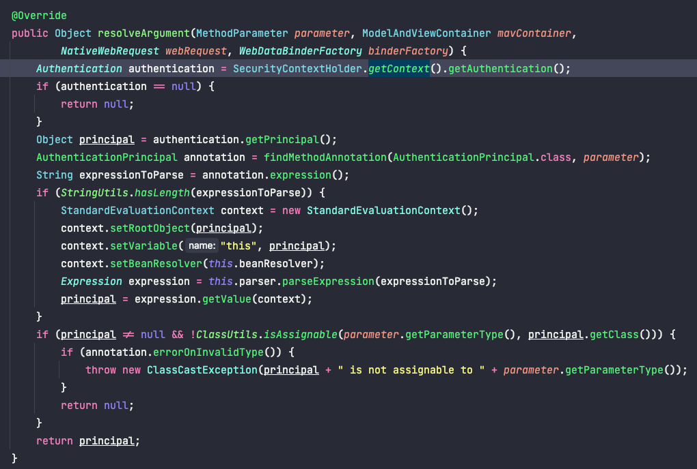

## 개요
최근 사이드 프로젝트를 진행하면서 인증을 적용하고 있습니다.
그 과정에서 Spring Security를 사용해 사용자를 식별하는 @AuthenticationPrincipal 어노테이션을 제대로 사용하지 못해 동작방식을 알아보게 되었습니다.


## SecurityContext
우선 스프링 시큐리티는 기본적으로 Security Context를 통해 인증여부를 관리합니다.
인가가 정상적으로 처리될 경우 `SecurityContextHolder`내의 `SecurityContext`에 Authentication 인증객체를 저장합니다.
이때 Authentication 인증객체에는 아래의 사항들이 Thread Local에 저장되어 전역적으로 관리된다.
- principal
- credentials
- authorities
- details
- Authenticated

따라서 아래의 코드를 통해 인증객체를 가져와 최종인증 결과를 참조할 수 있습니다.
```java 
Authentication authentication = SecurityContexHolder.getContext()
                                                    .getAuthentication();
```

## @AuthenticationPrincipal
위에서 간단하게 어떻게 인증객체를 조회하는 방법을 알아보았습니다. 
이렇게 가져온 인증객체를 사용하기 위해 원하는 클래스로 바인딩하는 과정이 필요하고,
이를 지원하는 어노테이션인 `@AuthenticationPrincipal`을 사용한다.

```java
    @GetMapping("/api/1")
    public String sh(@AuthenticationPrincipal UserPrincipal userPrincipal) {
        return "hello";
    }
```

그렇기 때문에 `@AuthenticationPrincipal`에 인증객체와 원하는 클래스(UserPrincipal)을 바인딩하는 Resolver가 필요합니다.
그 Resolver가 바로 `AuthenticationPrincipalArgumentResolver` 입니다!

## AuthenticationPrincipalArgumentResolver
그럼 한번 Resolver가 어떻게 동작하는지 과정을 알아보겠습니다.



## 관련 포스팅
[[Spring Security] @AuthenticationPrincipal 어노테이션은 어떻게 동작할까??](https://sas-study.tistory.com/410)
[스프링 주요 아키텍처의 이해](https://catsbi.oopy.io/f9b0d83c-4775-47da-9c81-2261851fe0d0)