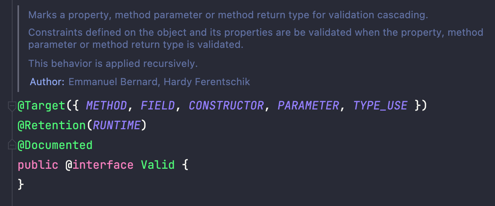
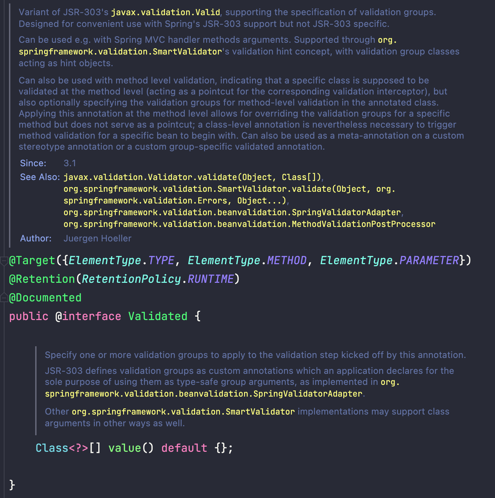

# 개요
최근 Spring의 `@Valid`어노테이션과 `@Validated` 어노테이션의 정확한 동작원리와 사용방법에 대해 궁금함을 가지게 되었습니다.  
부끄럽지만 개발일정을 맞추려다보니 차근차근 시간을 가지고 알아보지 못해서 마음 한켠에 쌓아두고 있었던 궁금증을 해결해보려 합니다.  
관련해서 너무나도 잘 정리해두신 글이 있어 읽어보며 정리해보려 합니다.

# @Valid & @Validated 너흰 뭐가 다르니?
요약하자면 `@Validated`는 Controller에서 직접적으로 유효성 검증을 처리하도록 하는 어노테이션이 아닙니다.  
Controller에서 직접적으로 유효성 검증을 처리하는 어노테이션은 `@Valid`입니다.  

여기서 이런 의문을 가질 수도 있습니다. ~~(제 얘기라는 건 안비밀)~~   
??? : 나는 `@validated` 어노테이션써도 정상적으로 유효성 처리가 돼서 `400 Bad Request`가 내려오던데?  
그 이유는 `@ValidSYSNAR`와 같이 `@Valid~~`로 시작하는 어노테이션이 있을 경우 유효성 검사를 해주기 때문입니다.  
결과적으로 저는 예외처리 기술을 "제대로" 사용하고 있지는 못했던 거죠.

# @Valid
자 이제 제대로 `@Valid` 어노테이션의 동작방식에 대해 제대로 알아봅시다.  

정리에 앞서 `@Valid` 어노테이션은 JSR 303(Java Specification Requests) 스펙으로 Bean Validator를 이용해 객체의 제약조건을 검증하도록 지시하는 어노테이션 입니다!  
Spring Validation에서는 
관련해 더 자세한 사항은 [스프링 공식문서](https://docs.spring.io/spring-framework/docs/3.2.x/spring-framework-reference/html/validation.html)를 통해 확인이 가능합니다.

## @Valid의 동작원리 
Spring으로 들어오는 모든 요청은 Front-Controller Pattern을 구현한 `Dispatcher-Servlet`으로 들어오게 됩니다.  
이후 이 Dispatch-Servlet이 다른 Controller에 요청을 전달하는 과정에서 Controller 메소드의 객체를 만들어주는 ArgumentResolver가 동작하게 됩니다.  
컨트롤러 메소드 앞에 붙어있는 `@Valid` 또한 이때 처리하게 됩니다.

<!-- 내 언어로 수정필요 -->
대표적으로 @RequestBody는 Json 메세지를 객체로 변환해주는 작업이 ArgumentResolver의 구현체인  
RequestResponseBodyMethodProcessor가 처리하며, 이 내부에서 @Valid로 시작하는 어노테이션이 있을 경우에 유효성 검사를 진행한다.   
(이러한 이유로 @Valid가 아니라 커스텀 어노테이션인 @ValidXXXX여도 동작한다.)   
만약 @ModelAttribute를 사용중이라면 ModelAttributeMethodProcessor에 의해 @Valid가 처리된다.

그리고 검증에 오류가 있다면 MethodArgumentNotValidException 예외가 발생하게 되고, 디스패처 서블릿에 기본으로 등록된 예외 리졸버(Exception Resolver)인 DefaultHandlerExceptionResolver에 의해 400 BadRequest 에러가 발생한다.

이러한 이유로 @Valid는 기본적으로 컨트롤러에서만 동작하며 기본적으로 다른 계층에서는 검증이 되지 않는다. 다른 계층에서 파라미터를 검증하기 위해서는 @Validated와 결합되어야 하는데, 아래에서 @Validated와 함께 자세히 살펴보도록 하자.
<!-- 내 언어로 수정필요 -->

# @Validated
앞서 설명했다시피 Spring의 기본적인 유효성 검증은 Controller에서 이루어진다.   
다만, Controller뿐만 아니라 다른 영역(Service, Repository)에서도 유효성 검증을 필요로 할 수 있다.  
이러한 요구사항을 만족시키기 위해 사용하는 것이 `@Validated` 어노테이션 입니다.

## 출처 : 
[스프링 공식문서 - 7. Validate](https://docs.spring.io/spring-framework/docs/3.2.x/spring-framework-reference/html/validation.html)  
[[Spring] @Valid와 @Validated를 이용한 유효성 검증의 동작 원리 및 사용법 예시](https://mangkyu.tistory.com/174)  
